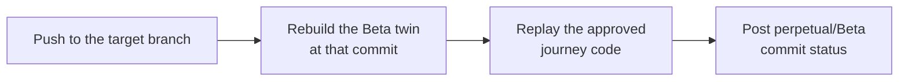

<p align="center">
  <picture>
    <source media="(prefers-color-scheme: dark)" srcset="public/assets/brand/perpetual-lockup-light.svg">
    
  </picture>
</p>

<p align="center"><b>Every push, tested the way your users use your app.</b></p>

<p align="center">Rebuild a local twin of your app on every push, replay approved business journeys, and report a GitHub check.</p>

<p align="center">
  <a href="#quickstart">Quickstart</a> ·
  <a href="docs/README.md">Docs</a> ·
  <a href="ROADMAP.md">Roadmap</a> ·
  <a href="https://github.com/willlzl/Perpetual/discussions">Discussions</a>
</p>

<p align="center">
  <a href="LICENSE"></a>
  <a href="https://github.com/willlzl/Perpetual/actions/workflows/ci.yml"></a>
</p>

Unit tests pass, CI is green, and sign-up or checkout is still broken. Perpetual catches that before the merge: it runs your real app with its real dependencies and walks through complete user journeys, then reports the result as a commit status your branch protection can require.

## How it works



1. **Twin.** Perpetual builds a Docker Compose twin of your application from its own code, with each dependency supplied by the vendor's official local mode or sandbox: local Supabase, a Stripe sandbox with `stripe listen` (Perpetual can create one for you), Mailpit, a real model.
2. **Journeys.** A browser agent explores the running app and drafts two to four complete business journeys, such as *sign up → subscribe → use a paid feature → see credits decrease*. You review each journey's goal, milestones and checks; an agent then writes its actions as Playwright code, with no checks of its own. You approve the code, seeing it or its diff, after it passes three runs and a control run with every write blocked, which a reviewed check must catch.
3. **Gate.** On every push to the target branch, Perpetual rebuilds the twin at that commit, replays the reviewed journeys' approved code with no model and posts a `perpetual/<Stage>` commit status. A failed journey blocks promotion; a blocked or needs-review result, including a journey without approved code, waits for a person to release it; a pass promotes the commit.

## Why Perpetual

- **Real code, real services.** Official simulations come first; [vercel-labs/emulate](https://github.com/vercel-labs/emulate) is used only where a vendor has none, and no API is hand-mocked. Each twin shows where every dependency came from.
- **Business outcomes, not clicks.** A journey passes only when its reviewed checks observe the result. Generated code performs actions and never contains checks, and a missing account or integration is reported as blocked, never simulated.
- **Same commit, same verdict.** Runs replay approved code with no model and no automatic retries, so replaying a journey costs no tokens. A model is used once per journey, to draft it and write its code.
- **A gate, not a report.** The commit status plugs into branch protection, so a broken journey stops the merge.
- **Local-first.** The controller runs on your machine and binds to loopback. It polls GitHub instead of needing a webhook or public URL, never deploys, and never copies production credentials.

## Quickstart

Paste this into your coding agent, in the repository you want tested. It installs Perpetual, then follows [docs/onboarding.md](docs/onboarding.md) with you: connecting GitHub, choosing the branch to gate, what the twin can and cannot simulate in your application, and creating the Beta environment.

```text
Set up Perpetual (https://github.com/willlzl/Perpetual) for this repository: clone it outside this repository, run `npm run setup` in the clone and install anything it reports missing, then follow the clone's docs/onboarding.md with me, asking me its questions one at a time. Leave this repository unchanged, and ask me before you enter an API key or sign in anywhere.
```

Or by hand. Setup installs the dependencies, the interface, Chromium and the browser runtime, and names what the machine still lacks: Node.js 24.12+, Docker, [uv](https://docs.astral.sh/uv/) or the GitHub CLI.

```sh
git clone https://github.com/willlzl/Perpetual.git && cd Perpetual
npm run setup
node src/cli.ts serve --repo /path/to/your/app
```

Then open <http://127.0.0.1:4317>:

1. **Settings**: add an [OpenRouter API key](https://openrouter.ai/keys). A model writes the twin config, drafts journeys and writes their code; runs use none.
2. **Connect GitHub** and choose the repository and target branch. The gate watches repositories chosen this way.
3. Add a **Beta** stage and choose **Create Beta environment**. An agent writes the twin config from the repository, and the first build takes a few minutes.
4. Review each drafted journey, then **Generate code**, **Verify code** and **Approve code** from its menu. Run it and watch the browser live.
5. Push to the target branch: `perpetual/Beta` appears on the commit. Require it in your branch protection rules.

## Status

> [!NOTE]
> Perpetual is a 0.1 alpha: one controller per machine, for web applications that can run under Docker Compose.

<details>
<summary>Twin services and their provenance</summary>

| Service | Provided by |
| --- | --- |
| PostgreSQL, MongoDB, Redis, Mailpit, an LLM through OpenRouter | The actual service |
| Supabase, Stripe, Trigger.dev | The vendor's official local mode or sandbox |
| GitHub, Google, AWS, Linear, Vercel, Sign in with Apple | [vercel-labs/emulate](https://github.com/vercel-labs/emulate) |

</details>

Gate and manual runs replay approved Playwright code in a local Chromium with no model at run time; a manual run can also try a draft. An agent drafts journeys and writes their code, and a person approves code after 3 passing runs and a caught control run ([ADR 0001](docs/adr/0001-gate-runs-approved-playwright-code.md)). Not yet available: repairing journey code after the app changes, a GitHub App or webhooks, hosted twins, and production deploys. The desktop sandbox is experimental. See the [roadmap](ROADMAP.md).

## Documentation

- [Pipeline](docs/pipeline-ui.md): the stages, Build and Production, branches and the Git graph
- [Twins](docs/twins.md): how a twin is built and which services it supports
- [Journeys](docs/journeys.md): discovery, review, journey code and its verification, runs and recordings
- [CI/CD gate](docs/gate.md): commit statuses, release and branch protection
- [Providers](docs/providers.md): GitHub, Vercel and Railway connections
- [CLI](docs/cli.md) and the experimental [desktop sandbox](docs/desktop-sandbox.md)
- [Architecture](docs/README.md#architecture), [decision records](docs/adr/README.md) and the [glossary](CONTEXT.md)

## Open source and Cloud

Perpetual is fully usable on your own machine under the AGPL. A hosted version is planned.

## Community

- [Discussions](https://github.com/willlzl/Perpetual/discussions) for questions and ideas
- [Issues](https://github.com/willlzl/Perpetual/issues) for bugs
- [SECURITY.md](SECURITY.md) for reporting vulnerabilities privately

## Contributing

Contributions are welcome; start with [CONTRIBUTING.md](CONTRIBUTING.md) and the `good first issue` label. First-time contributors sign the [CLA](CLA.md) once by commenting on their pull request. Coding agents should read [AGENTS.md](AGENTS.md).

## License

Perpetual is licensed under the [GNU Affero General Public License v3.0 only](LICENSE) (`AGPL-3.0-only`).

- Running Perpetual unmodified, on your machine, in your CI or inside your organization, requires nothing further.
- If you modify Perpetual and let users interact with your modified version over a network, such as a hosted service, you must offer those users its complete corresponding source under the same license (section 13).
- The Perpetual name and logos are not licensed under the AGPL; see [TRADEMARKS.md](TRADEMARKS.md). Third-party components keep their own licenses; see [docs/ASSETS.md](docs/ASSETS.md) and [NOTICE](NOTICE).
