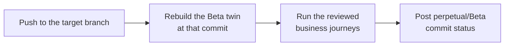

<p align="center">
  <picture>
    <source media="(prefers-color-scheme: dark)" srcset="public/assets/brand/perpetual-lockup-light.svg">
    
  </picture>
</p>

<p align="center"><b>Every push, tested the way your users use your app.</b></p>

<p align="center">Rebuild a local twin of your app on every push, replay approved business journeys, and report a GitHub check.</p>

<p align="center">
  <a href="#quickstart">Quickstart</a> ·
  <a href="docs/README.md">Docs</a> ·
  <a href="ROADMAP.md">Roadmap</a> ·
  <a href="https://github.com/glennlzl/Perpetual-CI-CD/discussions">Discussions</a>
</p>

<p align="center">
  <a href="LICENSE"></a>
  <a href="https://github.com/glennlzl/Perpetual-CI-CD/actions/workflows/ci.yml"></a>
</p>

Unit tests pass, CI is green, and sign-up or checkout is still broken. Perpetual catches that before the merge: it runs your real app with its real dependencies and walks through complete user journeys, then reports the result as a commit status your branch protection can require.

## How it works



1. **Twin.** Perpetual builds a Docker Compose twin of your application from its own code, with each dependency supplied by the vendor's official local mode or sandbox: local Supabase, the Stripe sandbox with `stripe listen`, Mailpit, a real model.
2. **Journeys.** A browser agent explores the running app and drafts two to four complete business journeys, such as *sign up → subscribe → use a paid feature → see credits decrease*. You review each journey's goal, milestones and checks before it can run.
3. **Gate.** On every push to the target branch, Perpetual rebuilds the twin at that commit, runs the reviewed journeys and posts a `perpetual/<Stage>` commit status. A failed journey blocks promotion; a blocked or needs-review result waits for a person to release it; a pass promotes the commit.

## Why Perpetual

- **Real code, real services.** Official simulations come first; [vercel-labs/emulate](https://github.com/vercel-labs/emulate) is used only where a vendor has none, and no API is hand-mocked. Each twin shows where every dependency came from.
- **Business outcomes, not clicks.** A journey passes only when its reviewed checks observe the result. An agent reporting "done" is never a pass, and a missing account or integration is reported as blocked, never simulated.
- **A gate, not a report.** The commit status plugs into branch protection, so a broken journey stops the merge.
- **Local-first.** The controller runs on your machine and binds to loopback. It polls GitHub instead of needing a webhook or public URL, never deploys, and never copies production credentials.

## Quickstart

Requires Node.js 22+, Docker with Compose, [uv](https://docs.astral.sh/uv/), the GitHub CLI signed in (`gh auth login`) and an [OpenRouter API key](https://openrouter.ai/keys).

```sh
git clone https://github.com/glennlzl/Perpetual-CI-CD.git
cd Perpetual-CI-CD
npm ci && npm run build
npx playwright install chromium
uv sync --project integrations/browser-use --frozen
uv run --project integrations/browser-use python -m playwright install chromium
node src/cli.mjs serve --repo /path/to/your/app
```

Then open <http://127.0.0.1:4317>:

1. Add your OpenRouter API key in **Settings**.
2. **Connect GitHub** and choose your repository and target branch. The gate watches repositories chosen this way; a local path is scanned but not watched.
3. Add a **Beta** stage and choose **Create Beta environment**. The first twin build pulls images and installs dependencies, which can take several minutes.
4. When the twin is ready, Perpetual drafts journeys. Review each one, then run it and watch the browser live.
5. Push to the target branch and watch `perpetual/Beta` appear on the commit. Add it as a required status check in your branch protection rules.

<details>
<summary>Set up with a coding agent</summary>

> Clone https://github.com/glennlzl/Perpetual-CI-CD, read its README, install it as the Quickstart describes and start `node src/cli.mjs serve --repo` on my repository. Do not change my repository, and ask me before entering any API key.

</details>

## Status

> [!NOTE]
> Perpetual is a 0.1 alpha: one controller per machine, for web applications that can run under Docker Compose.

<details>
<summary>Twin services and their provenance</summary>

| Service | Provided by |
| --- | --- |
| PostgreSQL, MongoDB, Redis, Mailpit, an LLM through OpenRouter | The actual service |
| Supabase, Stripe, Trigger.dev | The vendor's official local mode or sandbox |
| GitHub, Google, AWS, Linear, Vercel, Sign in with Apple | [vercel-labs/emulate](https://github.com/vercel-labs/emulate) |

</details>

Journeys run in a local browser today, driven by an agent against each journey's reviewed milestones, with independent checks deciding the verdict. Replaying approved Playwright code with no model at run time is available for manual runs and is becoming the gate's engine. Not yet available: a GitHub App or webhooks, hosted twins, and production deploys. The desktop sandbox is experimental. See the [roadmap](ROADMAP.md).

## Documentation

- [Pipeline](docs/pipeline-ui.md): the stages, Build & Deploy, branches and the Git graph
- [Twins](docs/twins.md): how a twin is built and which services it supports
- [Journeys](docs/journeys.md): discovery, review, runs, recordings and Playwright code
- [CI/CD gate](docs/gate.md): commit statuses, release and branch protection
- [Providers](docs/providers.md): GitHub, Vercel and Railway connections
- [CLI](docs/cli.md) and the experimental [desktop sandbox](docs/desktop-sandbox.md)
- [Architecture](docs/README.md#architecture) and the [glossary](CONTEXT.md)

## Open source and Cloud

Perpetual is fully usable on your own machine under the AGPL. A hosted version is planned.

## Community

- [Discussions](https://github.com/glennlzl/Perpetual-CI-CD/discussions) for questions and ideas
- [Issues](https://github.com/glennlzl/Perpetual-CI-CD/issues) for bugs
- [SECURITY.md](SECURITY.md) for reporting vulnerabilities privately

## Contributing

Contributions are welcome; start with [CONTRIBUTING.md](CONTRIBUTING.md) and the `good first issue` label. First-time contributors sign the [CLA](CLA.md) once by commenting on their pull request. Coding agents should read [AGENTS.md](AGENTS.md).

## License

Perpetual is licensed under the [GNU Affero General Public License v3.0 only](LICENSE) (`AGPL-3.0-only`).

- Running Perpetual unmodified, on your machine, in your CI or inside your organization, requires nothing further.
- If you modify Perpetual and let users interact with your modified version over a network, such as a hosted service, you must offer those users its complete corresponding source under the same license (section 13).
- The Perpetual name and logos are not licensed under the AGPL; see [TRADEMARKS.md](TRADEMARKS.md). Third-party components keep their own licenses; see [docs/ASSETS.md](docs/ASSETS.md) and [NOTICE](NOTICE).
